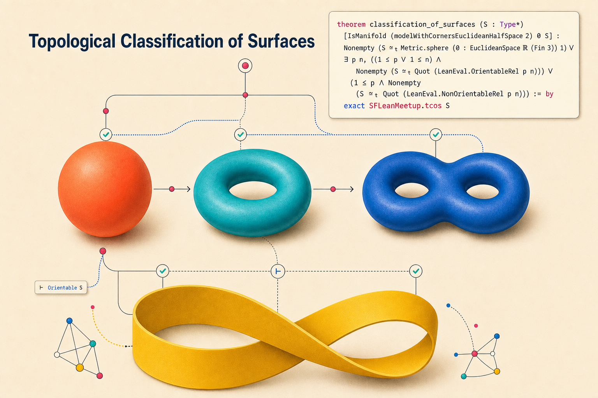

# Classification of Compact Surfaces



This repository contains a Lean proof of the Lean Eval challenge
`topological_classification_of_surfaces` and shared work toward the related
`jordan_curve` and `schoenflies` problems.  [Lean Eval problem](https://lean-lang.org/eval/problems/topological_classification_of_surfaces/)

It proves that every compact connected Hausdorff topological 2-manifold with boundary is
homeomorphic to the sphere, an orientable normal-form quotient, or a non-orientable normal-form
quotient.

## Authorship

This is a collaborative work of the SF LEAN meetup, undertaken as an exercise in autoformalization.  Most of the autoformalization work was done via ChatGPT Sol, with contributions from Claude Fable and other models.

If you are in the bay area, come to the [weekly meetup](https://luma.com/yi9idc15) at the SF Mox coworking space.


## Documents

- `ClassificationOfSurfaces/API.lean`: public Lean API map and preferred code entry point.
- `docs/ARCHITECTURE.md`: proof architecture and source-file map.
- `docs/DESIGN_DECISIONS.md`: stable design choices behind the formalization.
- `docs/AUTOFORMALIZATION_GUIDE.md`: definition-faithfulness and maintenance rules.
- `blueprint/src/content.tex`: theorem-by-theorem proof blueprint.
- `CONTRIBUTING.md`: collaboration workflow.

## Build

```bash
lake build
```

The public classification proof is complete and contains no `sorry`.

## Lean Eval submissions

The repository is directly submittable to Lean Eval.  Exact benchmark workspaces
live side by side under `LeanEval/`; Lean Eval discovers them by the `name` in
each `lakefile.toml` and overlays only their `Submission.lean` and
`Submission/**/*.lean` files onto pristine benchmark workspaces.

The large supporting payloads are generated from the normal source tree:

```bash
python3 port_submission.py          # refresh every ready payload
python3 port_submission.py --check  # verify that checked-in payloads are current
python3 port_submission.py --list   # show ready submissions and scaffolds
```

`jordan_curve` and `topological_classification_of_surfaces` are wired to complete
proofs.  `schoenflies` has the correct workspace shape but remains a scaffold
until the full theorem is proved.  See [`LeanEval/README.md`](LeanEval/README.md)
for the layout, local comparator commands, CI behavior, and the steps for adding
another shared source root.

Normal pull requests build only the development project.  Apply the
`lean-eval-submission` label when a PR's generated payloads are ready for the
standalone Lean Eval freshness and comparator checks; the same workflow can also
be started manually for any revision.

## Architecture

The proof is organized around the faithful finite-cyclic polygonal-realization handoff:

```lean
GeometricTriangulation.toFiniteCyclicPresentation
FiniteCyclicPresentation.PolygonalRealization
```

The completed Moise–Radó route produces a faithful `GeometricTriangulation`. Its cyclic face
presentation is homeomorphic to the geometric realization, Gallier–Xu normalization preserves the
polygonal realization, and the three canonical endpoints realize the exact Lean-Eval
representatives:

```text
GeometricTriangulation
  → FiniteCyclicPresentation
  → NormalForm.canonicalPresentation
  → vendored Lean-Eval quotient
```

The final theorem `classification_of_surfaces`, with blueprint-facing wrapper
`topological_classification_of_surfaces`, is the composition of these faithful homeomorphisms.
`SurfaceCellComplex` now contains only finite incidence data; its former arbitrary realization
fields and compatibility aliases have been removed.

## Result

- The repository builds with `lake build`.
- The bottom API has concrete finite combinatorial data:
  `SurfaceCellComplex`, signed darts, oriented triangulation edges, one-face presentations, and a
  data-preserving triangulation-to-cell-complex conversion.
- Standard example boundary words for the disk, annulus, torus, projective plane, and Mobius strip
  compile as `SurfaceCellComplex` values.
- The C0 chart-boundary seam is discharged: planar no-retraction gives Brouwer's fixed-point
  theorem, hence invariance of domain and an unconditional `ChartBoundaryInvariant` instance.
- The Moise/PL triangulation route is complete for compact connected Eval surfaces, including
  surfaces with manifold boundary, and uses only the hypotheses in the Lean Eval statement.
- The geometric triangulation is faithfully identified with its finite-cyclic polygonal quotient.
- Gallier–Xu normalization reaches an admissible canonical presentation while preserving that
  quotient.
- The sphere, orientable, and nonorientable canonical presentations realize the exact vendored
  Lean-Eval representatives.
- `classification_of_surfaces` composes this faithful chain directly.
