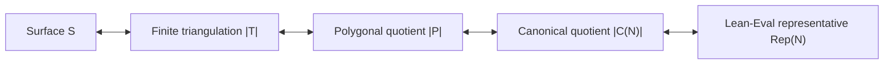

# A First Digestion of the Classification Proof

> Status: first end-to-end informalization, 1 August 2026.
>
> This document follows the declarations used by the final theorem and explains their mathematical
> role. It is deliberately more conceptual than the theorem-by-theorem
> [blueprint](../blueprint/src/content.tex), and more linear than the
> [architecture map](ARCHITECTURE.md). It is not yet a polished exposition of every supporting
> lemma. The final section records exactly what has and has not been digested in this pass.

The purpose of this document is to make the formal proof readable as a mathematical argument. A
Lean name appears when it is a useful anchor into the source, but the narrative is organized by
mathematical ideas rather than by files. In particular, it distinguishes the dependency spine of
the final theorem from parallel APIs and historical scaffolding that happen to live in the same
repository.

The model for this kind of writing is the following pattern: begin with the natural construction,
separate the proof into a small number of genuine obligations, identify the places where real work
is hidden, and only then recover the exact formal statement. This is the method used in
[Terry Tao's digestion of the Jacobian-conjecture counterexample](https://terrytao.wordpress.com/2026/07/21/a-digestion-of-the-jacobian-conjecture-counterexample/).

## Contents

- [1. What is actually proved](#1-what-is-actually-proved)
- [2. The proof in one page](#2-the-proof-in-one-page)
- [3. Stage I: obtaining a finite triangulation](#3-stage-i-obtaining-a-finite-triangulation)
- [4. Stage II: replacing the triangulation by a polygonal presentation](#4-stage-ii-replacing-the-triangulation-by-a-polygonal-presentation)
- [5. Stage III: normalizing the signed boundary words](#5-stage-iii-normalizing-the-signed-boundary-words)
- [6. Stage IV: matching the exact canonical representatives](#6-stage-iv-matching-the-exact-canonical-representatives)
- [7. Where the real work is](#7-where-the-real-work-is)
- [8. Lean scaffolding versus mathematical content](#8-lean-scaffolding-versus-mathematical-content)
- [9. A Lean-to-mathematics glossary](#9-a-lean-to-mathematics-glossary)
- [10. A source-guided reading route](#10-a-source-guided-reading-route)
- [11. Coverage and digestion debt](#11-coverage-and-digestion-debt)

## 1. What is actually proved

Let \(S\) be a compact connected Hausdorff topological \(2\)-manifold modeled on the closed
half-plane. Its manifold boundary may be empty. The theorem proves that \(S\) is homeomorphic to
one of the following spaces.

1. The unit sphere \(S^2\subset\mathbb R^3\).
2. A quotient of a closed disk whose boundary word is
   \[
   a_1b_1a_1^{-1}b_1^{-1}\cdots
   a_pb_pa_p^{-1}b_p^{-1}
   c_1h_1c_1^{-1}\cdots c_nh_nc_n^{-1}.
   \]
   In the standard interpretation this is an orientable surface with \(p\) handles and \(n\)
   boundary components. The parameters satisfy \(p\geq 1\) or \(n\geq 1\); the omitted case
   \((p,n)=(0,0)\) is represented by the separate sphere branch.
3. A quotient of a closed disk whose boundary word is
   \[
   a_1a_1\cdots a_pa_p
   c_1h_1c_1^{-1}\cdots c_nh_nc_n^{-1}.
   \]
   In the standard interpretation this is a nonorientable surface with \(p\geq 1\) crosscaps and
   \(n\) boundary components.

The symbols \(h_j\) above denote the free side of a boundary block; they do **not** denote
handles. The handle blocks are the commutators in the orientable word.

In Lean these alternatives are indexed by `NormalForm`, their side conditions are
`NormalForm.IsEvalAdmissible`, and the corresponding types are selected by
`NormalForm.Representative` in
[`Representatives.lean`](../ClassificationOfSurfaces/Representatives.lean). The orientable and
nonorientable targets are literally the quotients from the vendored Lean-Eval statement in
[`LeanEval/ChallengeDeps.lean`](../ClassificationOfSurfaces/LeanEval/ChallengeDeps.lean), not
new project-owned substitutes.

There is an important limitation. The current theorem is an **existence** theorem. It does not
prove in Lean that the three branches are disjoint, that two canonical representatives are
homeomorphic only when their branch and parameters agree, or that any two admissible outputs for
the same surface have equal branch and parameters. Thus the proof supplies a normal-form
representative, but not yet a certified complete invariant or a decision procedure for
homeomorphism.

The most reusable final statement is
`exists_homeomorphic_normalForm` in
[`EvalStatement.lean`](../ClassificationOfSurfaces/EvalStatement.lean):

```lean
∃ N : NormalForm,
  N.IsEvalAdmissible ∧ Nonempty (S ≃ₜ N.Representative)
```

`classification_of_surfaces` merely expands this indexed conclusion into the nested disjunction
required by Lean-Eval. `topological_classification_of_surfaces` is an exact alias retained for the
name used by the blueprint.

## 2. The proof in one page

There are four mathematical stages.

1. **Triangulate the surface.** A bordered version of the Moise--Radó argument gives a finite
   simplicial complex \(T\) and a homeomorphism \(|T|\cong S\).
2. **Cut the triangulation into polygons.** Regard every triangle as a separate polygon and record
   which oriented sides are glued. The resulting finite cyclic presentation \(P\) has a polygonal
   quotient \(|P|\) homeomorphic to \(|T|\), hence to \(S\).
3. **Normalize the polygonal schema.** Face splitting, face merging, edge subdivision, relabeling,
   and reversal of a face traversal do not change the quotient up to homeomorphism. A terminating
   sequence of such moves changes \(P\) into a canonical presentation \(C(N)\) made from handle,
   crosscap, and boundary blocks.
4. **Identify the canonical quotient.** Direct coordinate calculations show that \(|C(N)|\) is
   homeomorphic to the exact sphere, orientable quotient, or nonorientable quotient occurring in
   the Lean-Eval statement.



The final Lean term uses the homeomorphisms in the following direction:

\[
S \xrightarrow{\ h_{PS}^{-1}\ } |P|
  \xrightarrow{\ h_{PC}\ } |C(N)|
  \xrightarrow{\ h_{CN}\ } \operatorname{Representative}(N).
\]

Here `hPS : |P| ≃ₜ S`. The last two arrows are already composed into `hPN` by the finite-cyclic
normal-form API, so the final line of the proof is exactly `hPS.symm.trans hPN`.

This four-stage decomposition is the central fact to retain. Most of the size of the repository
comes from proving that none of these arrows silently changes the underlying topological space.

## 3. Stage I: obtaining a finite triangulation

### 3.1 Why the boundary is a real issue

The local model is the closed half-plane. Points on its edge model manifold-boundary points, while
points with positive normal coordinate model interior points. A chart transition is only a
homeomorphism between relatively open subsets of the half-plane, so it is not definitionally clear
that it preserves this distinction.

The proof first establishes the required invariance of the boundary stratum. The foundational
chain runs through planar no-retraction, Brouwer's fixed-point theorem, and invariance of domain;
see [`Moise/NoRetraction.lean`](../ClassificationOfSurfaces/Moise/NoRetraction.lean),
[`Moise/Brouwer.lean`](../ClassificationOfSurfaces/Moise/Brouwer.lean), and
[`Topology/InvarianceOfDomain.lean`](../ClassificationOfSurfaces/Topology/InvarianceOfDomain.lean).

This enters [`Moise/BoundaryInvariant.lean`](../ClassificationOfSurfaces/Moise/BoundaryInvariant.lean)
in two distinct ways. First, the any-chart characterization of boundary points gives the
chart-level `ChartBoundaryInvariant` instance: a boundary point maps to the frontier of the
extended chart target. Second, a separate relative half-plane theorem doubles a
boundary-preserving embedding by reflection across the edge line and applies planar invariance of
domain. That second result controls boundary-preserving re-embeddings later in chart straightening;
it is not the definition of the chart-level instance.

Conceptually, this proves that “being on the edge of a half-plane chart” is intrinsic to the
surface and not an accident of a chosen chart. Without it, a local straightening could turn a
manifold-boundary arc into an interior arc, and the bordered Radó induction would not be faithful.

### 3.2 Disk and half-disk charts with compact cores

At each point, start with the preferred manifold chart.

- If the image point has positive normal coordinate, choose a small ball contained in the chart
  image and recenter it to the unit disk.
- If the image point has zero normal coordinate, choose a small relative half-ball and recenter it
  to the unit half-disk.

In either case, retain the radius-one-half closed disk or half-disk as a compact **core**. Boundary
invariance makes the chart boundary-faithful: a point lies on the manifold boundary exactly when
its half-disk coordinate lies on the straight edge. These constructions are `MoiseChart`,
`MoiseChart.BoundaryFaithful`, and `exists_moiseChart_core_mem_nhds` in
[`Moise/ChartExtraction.lean`](../ClassificationOfSurfaces/Moise/ChartExtraction.lean).

The interiors of the cores cover \(S\). Compactness reduces this to finitely many charts. This is
the only place where the passage from local charts to a finite induction is made.

### 3.3 Partial triangulations and the Radó invariant

A `PartialTriangulation S` is a finite family of abstract triangles together with an embedding of
its barycentric realization into \(S\). It need not cover the whole surface. Its support is the
image of that embedding.

Suppose \(A\) is the union of the chart cores absorbed so far. The structure `RadoInvariant T A`
records four facts.

1. \(A\) is compact.
2. Every edge of \(T\) belongs to at most two triangles.
3. The intersection of each triangle with the manifold boundary is an exposed simplicial face.
4. \(A\) lies in the topological interior, relative to \(S\), of the support of \(T\).

The fourth clause is deliberately an ambient topological statement. A point on \(\partial S\) can
be an interior point of a half-disk neighborhood as a subset of \(S\), although it lies on the
combinatorial boundary of that half-disk. Replacing this clause by “combinatorial interior” would
make the bordered induction false.

Nor does the invariant claim that every intermediate complex is already a combinatorial
2-manifold: the edge-valence bound alone would not force connected vertex links. The final
homeomorphism to \(S\), together with separate incidence arguments, supplies what is actually
needed later.

The relevant definitions and the entire induction live in
[`Moise/ChartInduction.lean`](../ClassificationOfSurfaces/Moise/ChartInduction.lean).

### 3.4 Absorbing one more chart

There are three cases.

1. If the new core is already in the interior of the old support, keep the old partial
   triangulation.
2. If all previously absorbed cores lie in the interior of the standard patch carried by the new
   chart, replace the old partial triangulation by that patch.
3. Otherwise the old support genuinely crosses the chart patch. This is the difficult case.

In the crossing case the old embedded complex is straightened in chart coordinates so that it can
be compared with a fixed triangulated disk or half-disk patch. The approximation is adaptive: its
error is forced to tend to zero at the frontier of the chart overlap. This gives continuity when
the altered map is pasted to the unchanged map outside the overlap. The construction also keeps
the image inside the permitted chart region, keeps it disjoint from the unchanged outside image,
and preserves the half-plane edge line.

The straightened old complex and the chart patch are then refined to a common presentation on
their overlap. Their embeddings agree exactly on the shared realization, so they can be glued into
one embedded finite complex. The edge bound, boundary regularity, and interior coverage statements
survive the gluing. In the code the final crossing package is
`MoiseChart.exists_crossing_weld`, and the three-case theorem is `moise_induction_step`.

A fixed finite subdivision near the overlap is not enough here. It may approximate the old map
well on a compact collar but gives no reason for the error to vanish as one approaches the
frontier, which is exactly what the global pasting argument needs. The adaptive
frontier-controlled straightening is one of the genuine hard points of the proof.

### 3.5 Finishing the finite induction

Start with the empty partial triangulation and absorb the finitely many chart cores one at a time.
After the last step, the absorbed set is all of \(S\). Since it is contained in the support, the
support is all of \(S\). The embedding of the finite barycentric realization is therefore onto and
becomes the homeomorphism stored by `GeometricTriangulation S`.

The assembly theorem is `Moise.moise_triangulation_of_boundaries`; the public wrapper is
`moise_triangulation` in
[`Triangulation.lean`](../ClassificationOfSurfaces/Triangulation.lean).

### 3.6 The incidence facts needed downstream

The topology-to-combinatorics handoff needs more than a bare homeomorphism \(|T|\cong S\). The
proof establishes the following facts about the triangles.

- There is at least one triangle.
- Every edge belongs to at most two triangles.
- The dual graph, whose vertices are triangles and whose edges join triangles sharing a side, is
  connected.
- For every vertex, the incident triangles form a connected star when adjacency is required to
  use an edge containing that vertex.

The edge-valence proof rules out three triangles around one edge by using a planar neighborhood of
two of them, invariance of domain, and injectivity of the full realization. The dual-connectivity
proof observes that two different dual components could meet only at finitely many vertices; after
deleting those vertices they would disconnect the surface, contradicting finite-puncture
connectivity. The strong vertex-star statement similarly uses a punctured local chart: two star
components would separate it.

The first three facts form `TriangleFamily.SurfaceIncidence`. They yield the validity and
face-connectedness certificates passed to normalization. The strong-star theorem is kept separate
and is consumed earlier, when proving faithfulness of the polygonal quotient at vertices. See
[`Moise/EmbeddedComplexValence.lean`](../ClassificationOfSurfaces/Moise/EmbeddedComplexValence.lean),
[`Moise/DualConnectivity.lean`](../ClassificationOfSurfaces/Moise/DualConnectivity.lean), and
[`StrongVertexStar.lean`](../ClassificationOfSurfaces/StrongVertexStar.lean). The finite-puncture
connectivity input is developed in
[`Moise/PuncturedSurface.lean`](../ClassificationOfSurfaces/Moise/PuncturedSurface.lean).

## 4. Stage II: replacing the triangulation by a polygonal presentation

### 4.1 Signed triangle words

Choose a cyclic enumeration of the three vertices of each triangle, and choose a direction on
each global edge. Reading around a triangle now gives a cyclic word of length three in signed edge
names. A sign merely records whether that triangle traversal agrees with the arbitrarily chosen
direction of the edge.

The cyclic choice orients the stored traversal of each individual triangle, but the choices are
not required to be compatible around vertices and do **not** give a coherent global orientation
of the surface. They are bookkeeping choices that work equally well in the orientable and
nonorientable cases.

The code first packages the information as a `FiniteSurfaceTriangulation`, then replaces its
finite edge and face types by `Fin` and obtains a `FiniteCyclicPresentation`. Thus the dependency
spine is

```text
GeometricTriangulation
  -> FiniteSurfaceTriangulation
  -> FiniteCyclicPresentation.
```

The separate conversion to `SurfaceCellComplex` is a useful parallel adapter, but it is **not**
an intermediate in the final classification theorem. The signed-word construction is in
[`Triangulation.lean`](../ClassificationOfSurfaces/Triangulation.lean), and its finite enumeration
and transported certificates are in
[`FiniteCyclicTriangulation.lean`](../ClassificationOfSurfaces/FiniteCyclicTriangulation.lean).

There is a further API qualification. The intermediate `FiniteSurfaceTriangulation.Valid` field
does not by itself certify that its stored boundary words describe its stored realization, nor
does it contain all occurrence conditions needed by the cyclic presentation. In the classification
path those facts come from the separate `IncidenceCertificate` derived from the geometric
triangulation's `SurfaceIncidence`, together with the explicit length-three face words. The
faithfulness of the whole construction therefore comes from its geometric origin, not from an
arbitrary inhabitant of the compatibility record.

### 4.2 What validity and connectedness mean here

A `FiniteCyclicPresentation` consists of finitely many cyclic signed face words over finitely many
edge names. In the ordinary surface-valid case used by the final theorem:

- at least one face is present;
- every stored face word is nonempty;
- two stored words that are cyclic rotations of one another already name the same face;
- every edge name occurs in total once or twice.

An occurrence is a pair consisting of a face and a position in that face word. Keeping occurrences,
rather than only edge names, is essential when the same name appears twice in one word. An edge
occurring once is a boundary side; an edge occurring twice is paired. `IsConnected` means that the
face-adjacency graph is connected.

These predicates are exactly the finite incidence conditions used by normalization. By
themselves, they are not a general theorem that every such quotient is a topological manifold.
Faithfulness to \(S\) is proved separately for the presentation that comes from the genuine
geometric triangulation.

### 4.3 Reconstructing the topology from the words

Replace every face word of length \(m\) by a standard closed \(m\)-gon. Take the disjoint union of
these polygonal disks and glue the two occurrences of every paired edge by the appropriate affine
map of unit intervals. Equal signs use the same parameter direction; opposite signs reverse the
parameter. Edges that occur once remain unglued. The quotient is
`FiniteCyclicPresentation.PolygonalRealization`.

There is an evident facewise map from this quotient to \(|T|\): identify each polygon with the
corresponding closed barycentric triangle. The side formulas show that paired points have the same
image, so the map descends through the quotient and is onto.

The inverse is subtler. Given a point of \(|T|\), choose a triangle containing it and use that
triangle's inverse map. One must prove that this does not depend on the chosen triangle.

- In the interior of a triangle there is no choice.
- On an internal edge, the explicit side-pairing formula makes the choices from any two distinct
  containing triangles agree; on a boundary edge there is only one incident triangle.
- At a vertex, all incident triangle corners must be connected by a chain of such edge pairings.
  This is exactly where strong vertex-star connectivity is used.

Continuity of the inverse follows by gluing the facewise inverse maps over a finite closed cover.
This yields

```lean
GeometricTriangulation.polygonalRealizationHomeomorph
```

in
[`GeometricTriangulationRealization.lean`](../ClassificationOfSurfaces/GeometricTriangulationRealization.lean).
Composing it with the homeomorphism stored in the geometric triangulation gives
`compact_eval_surface_polygonalRealization_homeomorphic_surface`:

\[
|P|\cong |T|\cong S.
\]

This is the faithful handoff from topology to finite combinatorics. After it, the proof may change
the presentation, but every change must carry a homeomorphism of polygonal realizations.

## 5. Stage III: normalizing the signed boundary words

The normalization follows the classical polygonal-schema proof of the surface classification,
implemented in the language of finite cyclic words. The broad source is Chapter 6 of
[Gallier and Xu, *A Guide to the Classification Theorem for Compact Surfaces*](https://www.cis.upenn.edu/~jean/surfclassif-root.pdf).
The order below is the order of the completed Lean normalizer; it should not be replaced by a
generic recollection of the textbook algorithm.

### 5.1 The moves and their topological meaning

The primitive operations are as follows.

- **P1:** subdivide an edge globally. A positive occurrence is replaced by the two new pieces in
  forward order, and a negative occurrence by the same pieces in reverse order with reversed
  signs. Contraction is the inverse operation when its hypotheses hold.
- **P2:** split a cyclic face word into two faces by inserting a fresh diagonal. Read backward,
  this merges two faces along a shared edge.
- **Signed presentation isomorphism:** rename edge names, reverse chosen edge directions, and
  rotate cyclic words.
- **Unoriented presentation isomorphism:** additionally reverse the traversal of selected whole
  faces. Topologically this reflects the corresponding polygon disks.

Each primitive step has a proved homeomorphism of polygonal realizations. Derived Dyck,
crosscap, handle, and boundary-loop rewrites are finite chains of these primitives, not unproved
equations between words.

`NormalizationEquivalent` is the equivalence closure used by the completed proof. Its nodes bundle
surface validity, and its theorem `NormalizationEquivalent.polygonallyEquivalent` turns an entire
move chain into a homeomorphism of realizations. The definitions are spread across
[`FiniteCyclicP1.lean`](../ClassificationOfSurfaces/FiniteCyclicP1.lean),
[`FiniteCyclicP2.lean`](../ClassificationOfSurfaces/FiniteCyclicP2.lean),
[`FiniteCyclicNormalization.lean`](../ClassificationOfSurfaces/FiniteCyclicNormalization.lean), and
the derived-rewrite files.

This separation is essential. A syntactically plausible rewrite is not enough: it must preserve
edge multiplicities, face validity, connectedness when needed, and the topology of the quotient.

### 5.2 First merge all faces

If more than one face remains, connectedness of the face-adjacency graph supplies two distinct
faces sharing an edge. Reverse a face traversal if necessary so that the shared edge is read in
opposite directions. Mathematically, the two faces are now merged along that edge by reading a P2
split backward.

There is representation-sensitive bookkeeping here. The validity predicate forbids two stored
faces from being cyclically equal. The implementation therefore retains a marked adjacent
separator pair during the merge so that the new face cannot accidentally become a cyclic copy of
an untouched face. The certified marked merge is a common P1/P2 subdivision: the source separator
is expanded and the marked target is split to a shared refinement. Thus the completed recursive
step is not merely a bare backward P2 application. The separator is removed in the subsequent
cancellation phase. The number of faces decreases by one at every recursive call, so the process
terminates with one cyclic word. The main entry is `Reduction.reduceToOneFace` in
[`FiniteCyclicReduction.lean`](../ClassificationOfSurfaces/FiniteCyclicReduction.lean), with the
marked merge in
[`FiniteCyclicFaceMerge.lean`](../ClassificationOfSurfaces/FiniteCyclicFaceMerge.lean).

### 5.3 Cancel adjacent inverse pairs

In the one-face word, find a cyclically adjacent pair \(a a^{-1}\), rotate it to a convenient
position, and remove it by a certified P2--P1--P2 chain. Every cancellation shortens the word by
two. If cancellation exhausts all remaining letters, the input quotient belongs to the sphere
branch. The ordinary validity interface does not materialize an empty one-face endpoint; Lean
instead proves equivalence directly to the canonical valid two-monogon sphere presentation.

Otherwise the recursion stops at a **pair-reduced** one-face word: no cyclically adjacent inverse
pair remains. This is `cancelInversePairsFuel` in the `WordReduction` namespace; the face-merge
plus cancellation front end is `reduceAndCancel` in
[`FiniteCyclicWordReduction.lean`](../ClassificationOfSurfaces/FiniteCyclicWordReduction.lean).

### 5.4 Read the pair-reduced word as a chord diagram

The following is a useful mental picture, not an extra Lean data structure. Put the cyclic word
around a circle and join the two occurrences of every twice-used edge by a chord.

Because validity says every used edge occurs once or twice, each edge has one of three forms.

1. It occurs once. This is a boundary **segment**.
2. It occurs twice with the same sign. After the derived crosscap rewrite it is displayed as a
   square \(aa\), hence one crosscap block.
3. It occurs twice with opposite signs. If another oppositely signed pair interleaves it, the two
   crossing chords can be reorganized by three Dyck rewrites into the commutator
   \(aba^{-1}b^{-1}\), hence one handle block.

What if an oppositely signed pair has no immediately interleaving partner? Inspect the cyclic arc
between its two occurrences. Its first relevant edge either exposes a boundary segment, exposes a
same-sign pair, gives an interleaving pair, or is nested strictly inside the original pair. In the
last case repeat inside the shorter arc. The arc length decreases, so this search terminates at an
extractable boundary, crosscap, or handle feature.

After extracting a block, restore pair-reducedness of the shorter residual word and then repeat.
This is the mathematical core of the pairing-reduction phase: a finite pair-reduced word cannot
evade the three standard kinds of surface data forever.

### 5.5 Why the implementation uses marked tokens

The proof-producing implementation cannot simply cut out a displayed substring and forget it.
Later inverse cancellations may surround or cross the location of an already extracted block. The
completed normalizer therefore uses a marked word in which residual darts and protected handle,
crosscap, and boundary data are distinguished.

The state maintains four facts:

- expanding the marked tokens gives a valid one-face presentation;
- residual edge names are separated from protected edge names;
- every protected token has one of the certified block shapes;
- the protected-name spine is duplicate-free.

If a residual inverse pair crosses protected material, a contextual resolver commutes or rotates
the protected blocks until the pair can be cancelled, or until a boundary segment can be absorbed
into a boundary block. The protected interval becomes shorter at each recursive step. Extraction
then decreases the number of residual darts.

This token machine is Lean scaffolding around a standard mathematical promise: once a handle,
crosscap, or completed boundary block has been isolated, later simplification treats it as an
atomic block while keeping its names separate from the residual word. Raw boundary singletons are
different: two of them may be grouped and contracted, so exact raw labels and their cardinality are
not invariant. The formal state transports protected ownership and separation through every such
renaming and lowering operation. The final marked-extraction path enters at
`normalizePairReducedMarked`; earlier unmarked decomposition structures in the same file are not
on the final dependency spine.

### 5.6 Boundary segments versus boundary components

An edge that occurs once is only a free boundary segment. It need not by itself be a whole boundary
component. The normalizer therefore does not set \(n\) equal to the number of once-used edge names.

A canonical boundary component is displayed as a block
\(c h c^{-1}\): the two \(c\)-sides are glued to one another and the middle \(h\)-side remains
free. Extracting a boundary feature initially produces a raw singleton. A contextual resolution
can turn such a singleton into a completed block when a residual inverse pair encloses it.

At the terminal marked state, the intended mathematical reading of any raw boundary atoms that
remain is that they form one further outer contour. This is not stored as a separate topological
invariant in `MarkedExecutionState`; it is established operationally by the following construction.
The code inserts a fresh pair of carrier sides around the terminal word and runs the same
contextual resolver. If raw boundary atoms remain, it groups and contracts them into one
additional completed boundary block. If none remain, the fresh carrier pair cancels and no block
is added. Only after this process does the final path read \(n\) as the number of completed boundary
blocks.

This construction is the boundary-envelope phase ending in `boundaryCompletedWord`. It is the
formal reason that the final parameter \(n\) counts completed contours rather than letters that
happen to occur once.

### 5.7 Put the completed blocks in canonical order

At this point every block is a crosscap square, a handle commutator, or a boundary loop. The two
terminal branches perform their operations in slightly different orders.

1. If there are no crosscaps, move all boundary blocks to the end, preserving their relative
   order, and retain the handles. The result is the orientable normal form with
   parameters
   \[
   (p,n)=(\#\text{handles},\#\text{boundary blocks}).
   \]
2. If there is at least one crosscap, first repeatedly apply the standard identity
   \[
   \text{one crosscap} + \text{one handle}
     \ \sim\ \text{three crosscaps}.
   \]
   Thus each handle contributes two additional crosscaps, and the result is the nonorientable
   normal form with
   \[
   (p,n)=(\#\text{crosscaps}+2\#\text{handles},
          \#\text{boundary blocks}).
   \]
   Then move the boundary blocks to the end.
3. Reverse arbitrary edge orientations as needed and rename the duplicate-free edge list
   positionally to the typed canonical names.

The terminal construction is in
[`FiniteCyclicTerminalNormalization.lean`](../ClassificationOfSurfaces/FiniteCyclicTerminalNormalization.lean).
Its public entry point is
`FiniteCyclicPresentation.normalizeConnectedToCanonical`. It returns a `NormalizationResult`
containing an admissible `NormalForm` and a `NormalizationEquivalent` proof to that normal form's
exact canonical presentation.

### 5.8 Why the recursion terminates

The principal decreasing quantities are visible at different layers.

| Phase | Decreasing quantity |
| --- | --- |
| Merge faces | number of faces |
| Cancel inverse pairs | cyclic word length |
| Search a nested opposite pair | length of the intervening cyclic arc |
| Extract features | number of residual darts |
| Resolve a pair across protected blocks | length of the protected interval |
| Convert handles in the nonorientable branch | structural length of the remaining block list |

Several Lean definitions use an explicit `fuel` argument and then prove that the natural size
measure supplies sufficient fuel. This is an implementation of the above well-founded argument,
not an additional mathematical hypothesis.

## 6. Stage IV: matching the exact canonical representatives

### 6.1 The canonical finite words

For admissible \((p,n)\), the orientable canonical word is a concatenation of \(p\) commutator
blocks and \(n\) boundary blocks; its length is \(4p+3n\). The nonorientable word is a
concatenation of \(p\) square blocks and \(n\) boundary blocks; its length is \(2p+3n\).

These words, their exact positions, multiplicities, validity, and connectedness are proved in
[`CanonicalWords.lean`](../ClassificationOfSurfaces/CanonicalWords.lean) and
[`FiniteCyclicCanonical.lean`](../ClassificationOfSurfaces/FiniteCyclicCanonical.lean). The sphere
again uses a separate two-monogon presentation.

The classification of all side pairings is explicit:

- the two sides named by each orientable \(a_i\) or \(b_i\) are paired with opposite parameter
  direction;
- the two sides of each nonorientable \(a_i a_i\) block are paired with the same parameter
  direction;
- the two \(c_j\)-sides of a boundary block are paired with opposite parameter direction;
- the singleton \(h_j\)-side is not glued.

See [`CanonicalPairings.lean`](../ClassificationOfSurfaces/CanonicalPairings.lean).

### 6.2 From a one-face polygon to the benchmark disk

The polygon cell used by `PolygonalRealization` is not definitionally the closed unit disk used by
the Lean-Eval relations. The code constructs a homeomorphism between them and proves the exact
boundary-coordinate formula: side \(i\), at unit-interval parameter \(t\), maps to the benchmark
boundary point with angular parameter

\[
\frac{i+t}{m},
\]

where \(m\) is the word length. This is
`oneFacePolygonalPreRealizationHomeomorph_sidePoint` in
[`RepresentativeCarrier.lean`](../ClassificationOfSurfaces/RepresentativeCarrier.lean).

The proof then compares generators in **both** directions.

1. Every polygonal side pairing maps into the equivalence closure generated by the corresponding
   raw Lean-Eval relation.
2. Every constructor of the raw Lean-Eval relation maps back into the equivalence closure generated
   by the polygonal pairings.

The boundary blocks require an index reversal and an integral-period adjustment of the disk
coordinate; these are proved explicitly rather than hidden by a picture. Since the generated
equivalence relations agree under the carrier homeomorphism, quotient congruence gives the desired
homeomorphism. The comparison is in
[`CanonicalCoordinates.lean`](../ClassificationOfSurfaces/CanonicalCoordinates.lean) and
[`CanonicalGeneratorMaps.lean`](../ClassificationOfSurfaces/CanonicalGeneratorMaps.lean).

It is worth being precise about terminology here. `OrientableRel` and `NonOrientableRel` are raw
generating relations, not themselves proved equivalence relations. `Quot` identifies points under
the equivalence closure generated by those relations. The endpoint proof compares those generated
closures; it does not merely observe that the displayed words look alike.

### 6.3 The sphere endpoint

For the sphere, the two monogon disks map to the upper and lower hemispheres. Their boundary maps
agree after the prescribed monogon-side identification along the equator, so the map descends to
the quotient. The proof establishes the exact kernel relation and obtains a homeomorphism with the
unit sphere. This construction is in
[`SphereHemisphere.lean`](../ClassificationOfSurfaces/SphereHemisphere.lean),
[`SphereQuotientHomeomorph.lean`](../ClassificationOfSurfaces/SphereQuotientHomeomorph.lean), and
[`FiniteCyclicSphereRealization.lean`](../ClassificationOfSurfaces/FiniteCyclicSphereRealization.lean).

### 6.4 Uniform endpoint and final composition

`NormalForm.canonicalRealizationHomeomorph` dispatches over the three branches and returns

\[
|C(N)|\cong \operatorname{Representative}(N).
\]

`FiniteCyclicPresentation.NormalizationResult.representativeHomeomorph` composes this with the
realization homeomorphism supplied by the normalization chain. Finally,
`exists_homeomorphic_normalForm` composes with the inverse of \(|P|\cong S\). All three
compositions are visible in the short files
[`NormalForm.lean`](../ClassificationOfSurfaces/NormalForm.lean) and
[`EvalStatement.lean`](../ClassificationOfSurfaces/EvalStatement.lean).

## 7. Where the real work is

The proof has many long stretches of finite-index transport and quotient bookkeeping. The
following seams are the conceptual bottlenecks underneath that volume.

| Seam | What must genuinely be shown | What would go wrong without it |
| --- | --- | --- |
| Boundary invariance | Half-plane chart changes preserve the interior/boundary stratum. | A bordered chart patch could be glued with its edge in the wrong part of the surface. |
| Adaptive crossing weld | A chart-local PL replacement agrees asymptotically with the old embedding and can be glued exactly. | A merely close replacement need not paste continuously at the overlap frontier. |
| Incidence and star connectivity | Edge valence, dual connectivity, and connected fixed-vertex stars follow from the surface topology. | The signed presentation may fail its multiplicity/connectivity conditions, or its quotient may split one geometric vertex into several classes. |
| Faithful polygonal handoff | The facewise map is a homeomorphism from the side-pairing quotient to the barycentric realization, with no extra identifications or split vertices. | The combinatorial word could be only suggestive data, unrelated to \(S\). |
| Marked normalization | Every local rewrite is validity-safe, topology-preserving, and compatible with previously extracted blocks, with a decreasing measure. | A paper-level word manipulation could reuse a label, lose a boundary contour, or fail to terminate formally. |
| Exact endpoint comparison | The canonical polygon generators and the benchmark disk relations generate the same equivalence closure. | “This is the standard polygon” would leave a gap between the project model and the exact Eval target. |

These obligations are not left as appeals to a diagram. Each is represented by a substantial
family of Lean declarations. They are also the best candidates for future, more focused digestion
documents.

## 8. Lean scaffolding versus mathematical content

Several recurring constructions are necessary for Lean but should not be mistaken for extra
mathematics.

- Finite edge and face types are repeatedly replaced by `Fin n`; the resulting equivalences,
  casts, and “fresh last name” operations account for much code.
- A cyclic word is stored as a list plus rotation witnesses. The list has an arbitrary first
  position even though the polygon boundary does not.
- Edge directions and face traversals are arbitrary bookkeeping choices. Mathematically, rechoosing
  them does not change the surface. The current triangulation API fixes particular choices rather
  than exposing a theorem comparing every two choices; the downstream presentation layer does
  provide signed relabelings and whole-face reversals.
- Quotients are indexed by validity proofs, so composing maps often requires transporting across
  propositionally equal presentations.
- The inverse from a triangulation realization to the polygon quotient chooses a containing face
  noncomputably and then proves independence of the choice.
- The normalizer uses classical choice to select adjacent faces and actionable word features. It is
  a certified proof producer, not presently an executable classifier.
- The marked-token records and explicit fuel arguments expose invariants and termination to Lean.
  A paper proof would normally leave much of this state implicit.
- The would-be empty one-face endpoint is routed directly to a two-monogon sphere because the
  ordinary-valid API requires every face word to be nonempty.

There are also parallel or compatibility layers that are easy to confuse with the spine.

- `FiniteSurfaceTriangulation.toCellComplex` is not called by the final theorem; the classification
  route goes from `FiniteSurfaceTriangulation` directly to `FiniteCyclicPresentation`.
- `MoveEquivalent` is a syntactic move relation; the completed proof uses the validity-bundled
  `NormalizationEquivalent` because it has the faithful realization theorem.
- `classification_of_surfaces`, `topological_classification_of_surfaces`, and
  `FiniteCyclicPresentation.hasEvalRepresentative` are expanded compatibility statements. The two
  indexed `exists_homeomorphic_normalForm` theorems are the cleaner reusable API.

## 9. A Lean-to-mathematics glossary

| Lean name | Mathematical reading |
| --- | --- |
| `GeometricRealization V F` | Barycentric realization of the finite family of triangles `F`. |
| `GeometricTriangulation S` | A finite triangle family together with a homeomorphism of its realization to `S`. |
| `PartialTriangulation S` | A finite triangle complex embedded in, but not necessarily covering, `S`. |
| `RadoInvariant T A` | The edge, boundary, and interior-coverage conditions maintained while absorbing chart cores. |
| `TriangleFamily.SurfaceIncidence` | Nonempty faces, edge valence at most two, and connected triangle dual graph. |
| `SignedDart Edge` | An edge name together with the direction in which a face boundary traverses it. |
| `FiniteCyclicPresentation` | Finitely many signed cyclic face-boundary words. |
| `IsSurfaceValid` | The project's occurrence-count and stored-face validity predicate, not by itself a general combinatorial-manifold theorem. |
| `IsConnected` | Connectedness of the face-adjacency graph. |
| `PolygonalRealization` | Disjoint union of polygon disks modulo the equivalence relation generated by paired sides. |
| `NormalizationEquivalent` | A validity-bundled chain of moves whose polygonal realizations are homeomorphic. |
| `NormalizationResult P` | An admissible normal form plus a certified move chain from `P` to its exact canonical presentation. |
| `NormalForm.sphere` | The unit two-sphere branch. |
| `NormalForm.orientable p n` | The canonical word with `p` handle blocks and `n` boundary blocks; conventionally the corresponding orientable model. |
| `NormalForm.nonOrientable p n` | The canonical word with `p` crosscap blocks and `n` boundary blocks; conventionally the corresponding nonorientable model. |
| `NormalForm.IsEvalAdmissible` | The branch side conditions required by the Eval statement; not a uniqueness theorem or a general validity predicate. |
| `NormalForm.Representative` | The exact sphere or vendored quotient type selected by a normal form. |
| `OrientableRel`, `NonOrientableRel` | Raw disk-boundary gluing generators used by Lean-Eval. |

## 10. A source-guided reading route

For a human reader, the following order is more efficient than following imports from the bottom.

1. Read the final composition in
   [`EvalStatement.lean`](../ClassificationOfSurfaces/EvalStatement.lean) and the three cases in
   [`Representatives.lean`](../ClassificationOfSurfaces/Representatives.lean).
2. Read [`NormalForm.lean`](../ClassificationOfSurfaces/NormalForm.lean) to see the two
   homeomorphisms that are composed at the finite-presentation level.
3. Read the canonical words and pairing classification in
   [`CanonicalWords.lean`](../ClassificationOfSurfaces/CanonicalWords.lean) and
   [`CanonicalPairings.lean`](../ClassificationOfSurfaces/CanonicalPairings.lean), followed by the
   exact quotient comparison in
   [`CanonicalGeneratorMaps.lean`](../ClassificationOfSurfaces/CanonicalGeneratorMaps.lean).
4. Read the public end of
   [`FiniteCyclicTerminalNormalization.lean`](../ClassificationOfSurfaces/FiniteCyclicTerminalNormalization.lean),
   including its terminal block ordering. Then trace backward through `reduceAndCancel`,
   `normalizePairReducedMarked`, and boundary completion in
   [`FiniteCyclicWordReduction.lean`](../ClassificationOfSurfaces/FiniteCyclicWordReduction.lean).
5. Read the topology/combinatorics handoff in
   [`GeometricTriangulationRealization.lean`](../ClassificationOfSurfaces/GeometricTriangulationRealization.lean)
   and [`FiniteCyclicTriangulation.lean`](../ClassificationOfSurfaces/FiniteCyclicTriangulation.lean).
6. Finally, read the Radó assembly backward from `moise_induction_step` and
   `moise_triangulation_of_induction` in
   [`Moise/ChartInduction.lean`](../ClassificationOfSurfaces/Moise/ChartInduction.lean), opening the
   PL and polygonal-Schoenflies modules only where the crossing weld calls them.

This route first fixes the purpose of each layer, then descends into its implementation. The
[blueprint](../blueprint/src/content.tex) remains the better resource when a declaration-by-
declaration dependency graph is wanted.

## 11. Coverage and digestion debt

This first pass has read the complete dependency spine and the bodies of the public transitions.
It has also traced the control flow and invariants of the completed marked normalizer. It has not
attempted to restate every supporting lemma in a roughly 140,000-line development.

| Area | Coverage in this pass | Next useful artifact |
| --- | --- | --- |
| Final theorem and exact representatives | Detailed | A short polished statement explaining existence versus uniqueness. |
| Canonical words and quotient comparison | Detailed at the generator and composition level | A diagram of the disk coordinates for one handle, one crosscap, and one boundary block. |
| Finite-cyclic normalizer | Detailed control flow, invariants, and measures; local rewrite algebra summarized | Work through one nontrivial signed word by hand while naming each certified rewrite. |
| Triangulation-to-polygon quotient | Detailed construction and kernel argument | Draw the edge and vertex overlap cases used to prove the chosen-face inverse is well defined. |
| Bordered Radó induction | Detailed invariant and case split; the internal PL approximation chain summarized | A separate digestion of the crossing weld, including the frontier-error estimates. |
| Invariance of domain dependency | Dependency and role identified; foundational proof summarized | Trace no-retraction \(\Rightarrow\) Brouwer \(\Rightarrow\) invariance of domain declaration by declaration. |
| Classification invariants and uniqueness | Not part of the present formal theorem | Develop orientability, Euler characteristic, boundary count, and uniqueness as a future API. |

Two points deserve particular attention in the next iteration.

1. The bordered Radó crossing construction is the largest topological black box left in this
   narrative. It should be digested around one carefully drawn chart overlap rather than by listing
   its many approximation lemmas.
2. The marked normalizer is now structurally understood, but a worked polygon word would make the
   nested-versus-interleaved pair argument and boundary-envelope step much easier to remember.

Those are shortcomings of this informal document, not gaps marked by `sorry` in the Lean proof.
