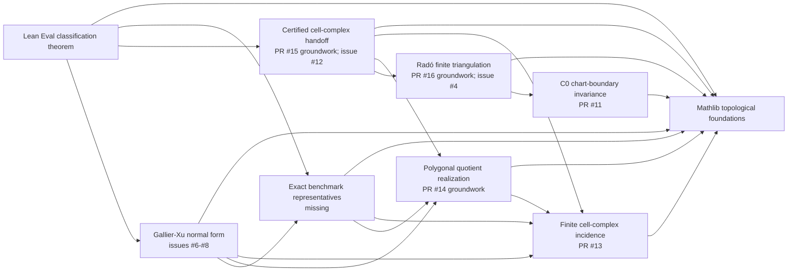

# Classification of surfaces: dependency roadmap

This plan targets the trusted Lean Eval theorem, not merely the similarly shaped local theorem. The
machine-readable graph is in `graph.json`; it contains 54 nodes in nine coarse clusters and records
the current open PRs as proved prerequisites rather than as completed end-to-end bridges.

## Coarse dependency graph

Arrows point from a result to its prerequisites.

## What the current PRs actually buy

| PR | Completed node | What it does not yet close |
|---|---|---|
| #11 | Unconditional C0 chart-boundary invariance | Independent of the two remaining proof holes |
| #13 | Honest incidence-derived validity and connectedness | The Eval call chain does not yet require the predicates |
| #14 | Marked polygon carriers, occurrence pairing, and a genuine additive quotient | `SurfaceCellComplex.Realization` and the benchmark representatives remain placeholders |
| #15 | Conditional incidence-certificate transport and valid/connected conversion | The Radó theorem does not yet produce the global certificate |
| #16 | Dual-union lemma and empty/chart-patch base certificates | The genuine overlap branch still lacks an actual face-family gluing construction |

The five PR tips merge at the Lean-source level. A synthetic integration build passed all 2,992
jobs; only the two pre-existing `sorry` warnings and the pre-existing `native_decide` remain.

There is one upstream integration choice to settle: PR #10 overlaps PR #13 with a different version
of the issue #9 API. PRs #14-#16 are built on #13, so merging #10 instead would require rebasing and
reconciling that incidence interface before the stack can land.

## Critical path

There are two parallel load-bearing branches.

1. **Topology and handoff.** Prove the Radó face-family gluing constructor, close the generic branch
   of `moise_induction_step`, retain global `SurfaceIncidence`, prove occurrence-pairing validity for
   converted triangles, and prove the triangulation-to-polygon-quotient homeomorphism.
2. **Faithful representatives and normal form.** Port the exact trusted closed-disc relations,
   complete the realization cutover, define cyclic-word P1/P2 moves, prove realization soundness,
   and formalize the six Gallier-Xu reduction stages with explicit validity and connectedness.

The second branch is now the larger body of remaining work. Closing issue #4 alone would remove the
triangulation `sorry`, but the local theorem would still not solve the comparator problem because
the representatives are points and the normal-form theorem is false as stated.

## Recommended PR order

1. Merge #11 and then the shared stack in the order #13, #14/#15, #16; resolve only the duplicated
   design-decision numbering found by the integration audit.
2. Prove `Triangulation occurrence-pairing validity` as the next small bridge.
3. Replace the local representative definitions with the exact Lean Eval definitions, then prove
   the marked-polygon-to-closed-disc parameter formulas.
4. Land the `SurfaceCellComplex.Realization` cutover and the triangulation quotient homeomorphism.
5. In parallel with the claimed issue #4 work, build the cyclic-word core and the honest P1/P2 move
   relation for issue #8.
6. Split elementary-move soundness and the six normal-form stages into independent PRs; finish with
   the corrected validity-aware theorem and the short Eval assembly.
